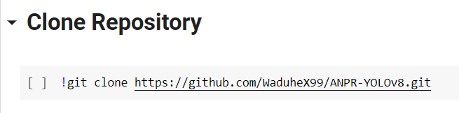
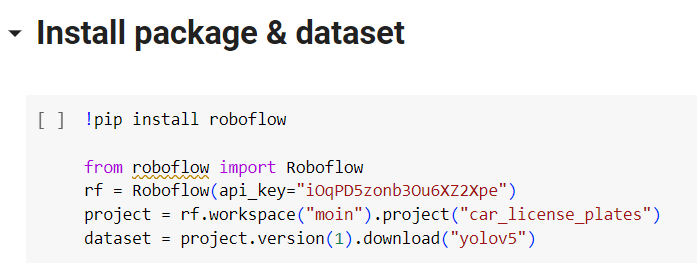

<H1 align="center">Automatic Number Plate Recognition using YOLOv8</H1>


This project was created using Python with openCV to recognize the number plates and EasyOCR to read the plates using YOLOv8 model

# Setup
- Run the IPython Notebook file
```anpr_advanced.ipynb```
- Run each existing cell sequentially
- You can skip the clone session if you have downloaded the manual file from this repository.

- You can change the dataset for training later. In this case, I used a dataset from roboflow.

```https://universe.roboflow.com/matheus-santos-almeida/car_license_plate/dataset/1```
- Download the weight I use
```!gdown "https://drive.google.com/uc?id=1dIyJooVaowaNUj0R1Q-HUnu-utiGsEj8&confirm=t"```
- Process the video that you want to detect
```!python predict.py model='weightFile.pt' source='demo.mp4'```

# Result


